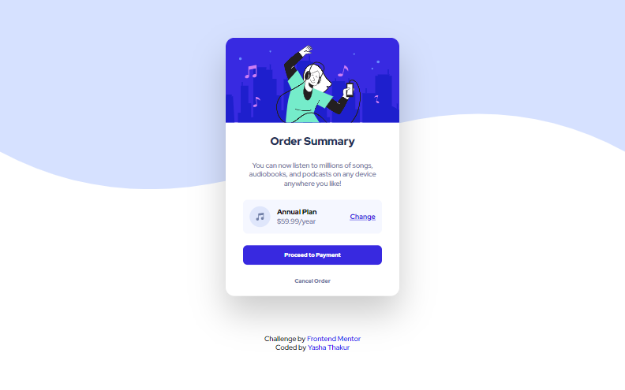

# Frontend Mentor - Order summary card solution

This is a solution to the [Order summary card challenge on Frontend Mentor](https://www.frontendmentor.io/challenges/order-summary-component-QlPmajDUj). Frontend Mentor challenges help you improve your coding skills by building realistic projects.

## Overview

### The challenge

Users should be able to:

- See hover states for interactive elements

### Screenshot

### Links

- [Solution URL](https://www.frontendmentor.io/solutions/order-summary-card-sWPFFrZFc)
- [Live Site URL](https://fervent-shaw-753ff9.netlify.app/)

## My process

### Built with

- Semantic HTML5 markup
- CSS custom properties
- Flexbox

## Author

- Website - [Yasha-Thakur](https://github.com/Yasha-Thakur)
- Frontend Mentor - [@Yasha-Thakur](https://www.frontendmentor.io/profile/Yasha-Thakur)
